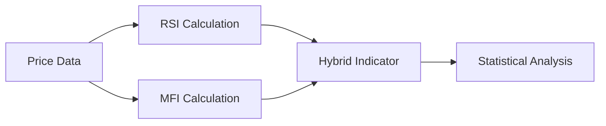

# ⚠️ RSI-MFI Consistency Research Project (Experimental) ⚠️


<div align="center" style="background-color: #fff3cd; padding: 1rem; border-radius: 8px; border: 2px solid #ffc107; margin: 1rem 0;">
<strong>❗ IMPORTANT LEGAL DISCLAIMER ❗</strong><br><br>
This is <strong>purely an academic research project</strong> inspired by TradingAgent's methodology. <strong>NOT a trading system</strong>. The developer provides <strong>absolutely no investment guarantee</strong> or reliability assurance. Use for learning and research only.
</div>

## 📌 Critical Notice Before Use

1. **Experimental Nature**: This software is designed solely for studying the statistical relationship between RSI and MFI indicators in academic contexts.

2. **No Financial Value**: All outputs are mathematical simulations with no proven efficacy in real markets.

3. **Prohibited Uses**:
   - ❌ Do NOT use with real money
   - ❌ Do NOT treat as trading signals
   - ❌ Do NOT consider as investment advice

4. **Professional Advisory Required**: Consult licensed financial advisors before making any investment decisions.

5. **Better Alternatives**: For actual trading systems, see [TradingAgents](https://github.com/TauricResearch/TradingAgents).

## 📊 Project Overview

A technical research tool examining the consistency relationship between:
- **RSI** (Relative Strength Index)
- **MFI** (Money Flow Index)



---

### 🛠️ Technical Features

| Component         | Description                        | Warning                                   |
|-------------------|------------------------------------|-------------------------------------------|
| Data Fetcher      | Gets historical OHLCV data         | 📉 Contains synthetic fill for missing data |
| RSI Engine        | Standard 14-period RSI             | 🔄 No optimization for current markets      |
| MFI Module        | Volume-weighted money flow         | 💧 Ignores market microstructure           |
| Hybrid Generator  | Custom RSI-MFI combination         | ⚗️ Experimental formula                    |

---

### 🚀 Installation

```bash
# Clone with warning
git clone https://github.com/021gink/RSI-MFI-Research.git && \
echo "WARNING: This is research code, not production software"

# Install dependencies
pip install -r requirements.txt
```

---

### 💻 Usage

```bash
streamlit run RSI-MFI.py
```

**Expected Output:**  
Academic charts showing indicator relationships.

**Not Output:**  
Actionable trading signals.

---

### 📜 Complete Disclaimer

By using this software, you irrevocably agree that:

- **No Warranty:** The software is provided "AS IS" without any performance guarantees
- **Financial Risk:** All market analysis contains inherent inaccuracies
- **No Liability:** Developer not responsible for any:
    - Trading losses
    - Missed opportunities
    - Tax implications
    - Emotional distress

**Academic Purpose:** Only suitable for:
- Indicator behavior studies
- Quantitative finance education
- Algorithmic research

**Professional Judgment Required:** Always verify results with:
- Licensed brokers
- Certified analysts
- Registered advisors


<div align="center" style="margin-top: 2rem;">
<strong>🚨 This project is not affiliated with any financial institution 🚨</strong><br>
<sub>Last updated: {DATE} | Version: 0.0.0-research</sub>
</div>
